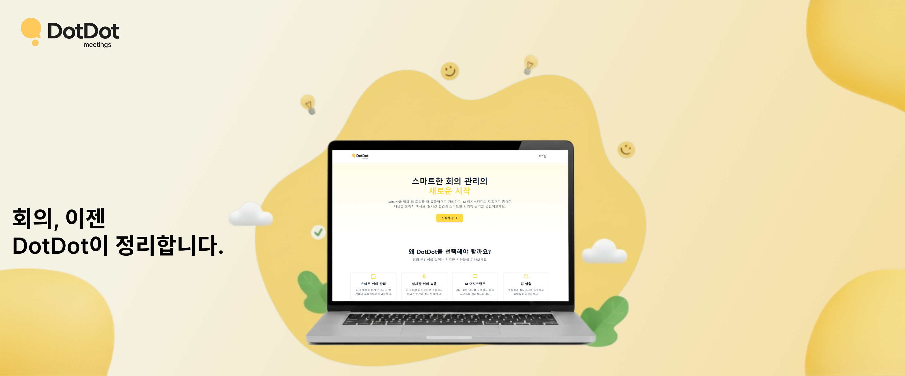
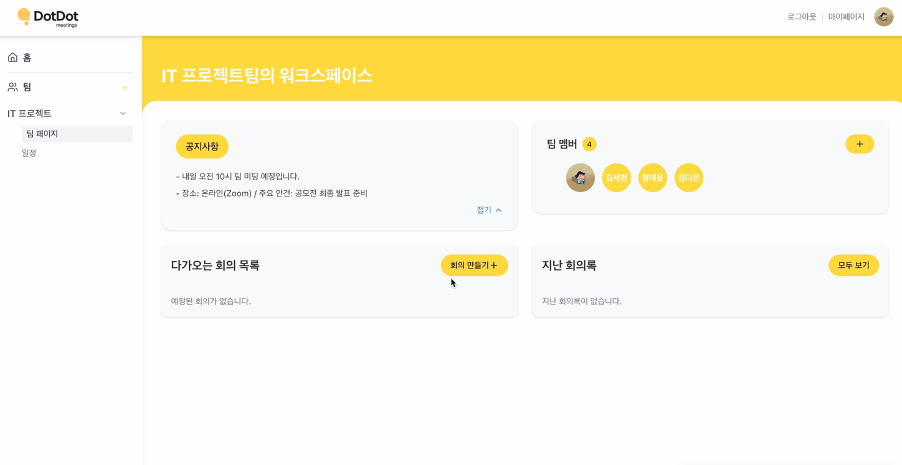
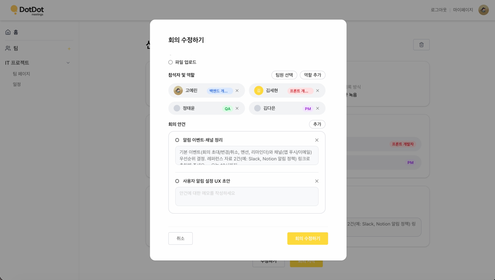
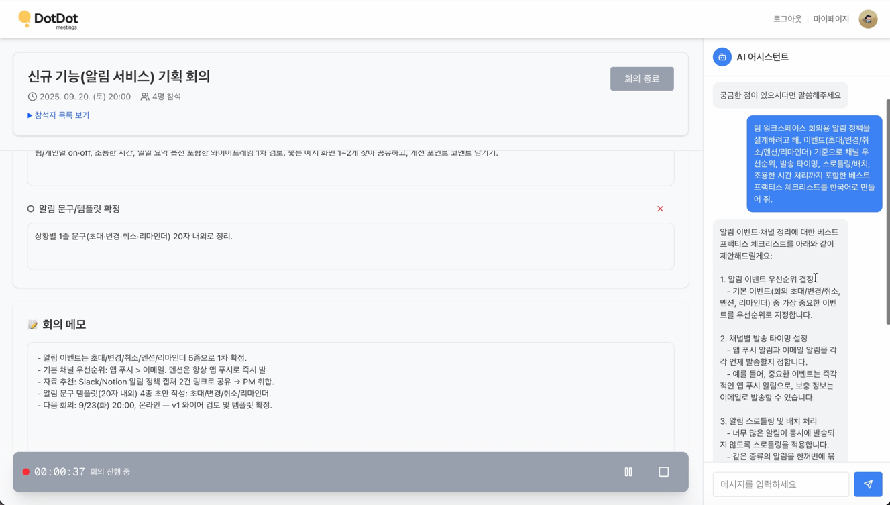
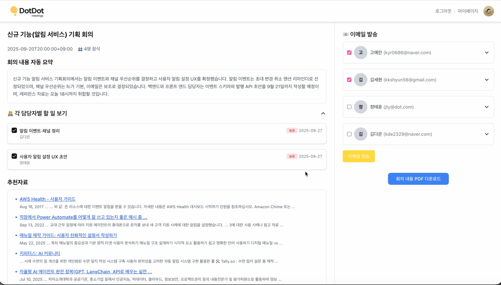
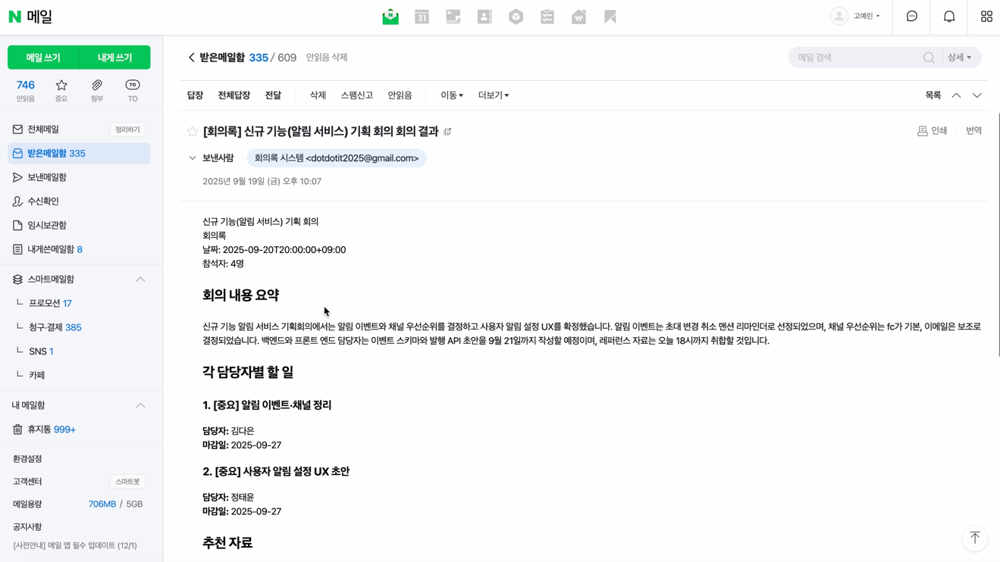
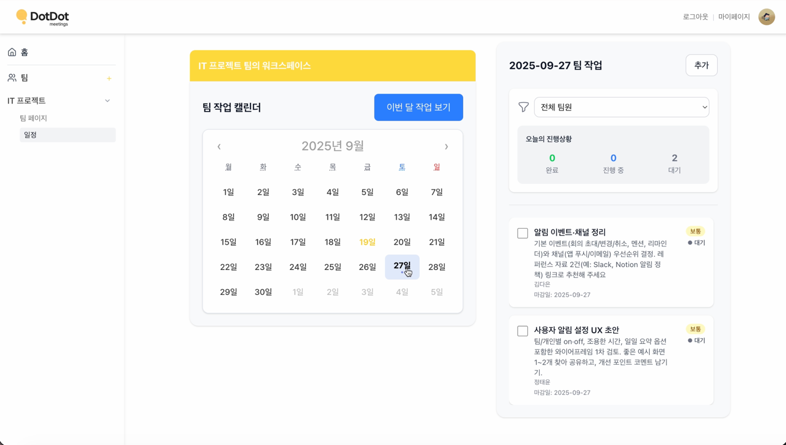
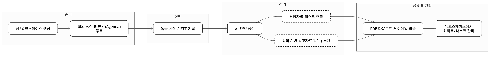
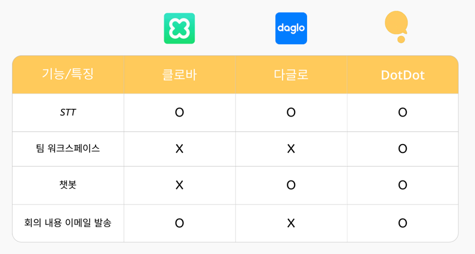

# DotDot

  

회의의 기록–정리–공유 전 과정을 자동화해, 팀이 회의의 소통과 의사결정에만 집중할 수 있도록 돕는 **회의 관리 서비스**입니다.

## 🔗 Quick Links
- 🌐 Service: https://dotdot.it.kr/ *(현재 백엔드 서버 종료로 프론트 화면만 노출)*
- 🧠 Backend Repo: https://github.com/DotDot5/DotDot_BE
- 🎨 Frontend Repo: https://github.com/DotDot5/DotDot_FE
- 🎬 Demo Video : https://youtu.be/8mZ2ROHvat8

> **개발 기간**: 2025.07.19 ~ 2025.10.28

 

## 👩🏻‍💻 🧑🏻‍💻 팀원 소개
|  |  |  |  |
|:---:|:---:|:---:|:---:|
| **고예린** | **김다은** | **김세현** | **정태윤** |
| [@nenini](https://github.com/nenini) | [@daeun088](https://github.com/daeun088) | [@kkshyun](https://github.com/kkshyun) | [@turden1](https://github.com/turden1) |

 

---

## 🤖 1) DotDot 소개

DotDot은 팀 회의에서 발생하는 **기록 누락**, **정리 부담**, **공유·후속 업무 누락** 문제를 해결하기 위한 **AI 회의 어시스턴트 플랫폼**입니다.  
회의 중에는 음성을 녹음하고 STT로 변환해 내용을 남기며, 회의 종료 후에는 핵심 요약과 담당자별 태스크를 자동으로 정리합니다.  
또한 팀별 워크스페이스에서 회의록과 팀원을 함께 관리하고, 결과를 **PDF로 다운로드**하거나 **이메일로 자동 발송**해 회의 이후의 업무 흐름까지 매끄럽게 이어지도록 돕습니다.

> **회의는 본질에만 집중하고, 기록과 정리는 DotDot에게 맡기세요.**

 

## ❓ 2) Why DotDot

DotDot은 아래 3가지 문제에서 출발했습니다.
- **가상 회의 증가**
- **비생산적 회의**
- **회의 파생 업무의 비효율**

DotDot은 회의의 모든 과정을 **“음성 기록 → 핵심 정리 → 자료 추천 → 태스크 추출 → 내용 공유”**로 연결해,  
팀이 회의 시간과 회의 이후 시간을 모두 절약할 수 있도록 설계되었습니다.

> ✅ TODO(선택): 각 항목에 1줄 설명을 추가하면 설득력이 더 올라갑니다.

 

## ✨ 3) 핵심 기능

- **음성 녹음 & STT 변환**
  - 회의 음성을 녹음하고 텍스트로 변환해, 중요한 논의가 누락되지 않도록 기록합니다.

- **회의 요약 & 담당자별 태스크 자동 추출**
  - 회의 내용을 핵심만 요약하고, 실행해야 할 업무를 **담당자 기준으로 구조화**해 정리합니다.

- **회의 결과 전달 및 다운로드**
  - 회의 리포트를 **이메일로 자동 발송**하고, **PDF로 다운로드**할 수 있어 공유 과정을 단축합니다.

- **팀별 워크스페이스**
  - 팀원, 회의록, 진행 상황을 한 곳에서 관리해 협업 맥락을 유지합니다.

- **주요 구간 북마크 & 다시 듣기**
  - 회의 중 중요 구간을 북마크로 저장하고, 해당 구간을 빠르게 다시 확인할 수 있습니다.

- **회의 기반 자료 추천**
  - 회의 내용을 분석해 관련 문서/아티클/가이드 등 **참고 자료 URL을 자동 추천**하여, 회의 후속 리서치와 공유를 빠르게 합니다.

 

---

## 🧭 4) User Journey / Flow

DotDot은 회의의 전 과정을 **준비 → 진행 → 정리 → 공유/관리**로 연결합니다.

### 1) 팀 워크스페이스 생성
팀을 만들고 멤버를 초대해, 팀 단위로 회의와 산출물을 한 곳에서 관리합니다.  

 

### 2) 회의 생성 & 안건(Agenda) 등록
회의 시작 전 안건을 등록해, 요약과 태스크 정리의 기준점을 고정합니다.  

 

### 3) 회의 진행: 녹음 & STT 기록
회의 음성을 녹음하고 STT로 변환해, 논의 흐름을 누락 없이 기록합니다.  

 

### 4) AI 자동 정리: 요약 · 태스크 · 참고자료 추천
회의 종료 후 핵심 요약을 생성하고, 담당자별 태스크를 추출하며, 관련 참고자료 URL을 추천합니다.  

 

### 5) 공유 & 후속 관리: PDF/이메일 · 태스크 관리
회의 결과를 PDF로 다운로드하거나 이메일로 공유하고, 워크스페이스에서 태스크 진행 상황을 관리합니다.  

 

#### 🔄 DotDot User Flow Diagram

 

---

## 🆚 5) 차별점 (Differentiation)

- **안건 기반 AI 회의 어시스턴트**
  - 회의 전에 등록한 안건을 기준으로 논의 흐름을 정리해, 요약/태스크가 “회의 목적”에 맞게 생성됩니다.

- **회의에서 실행으로 이어지는 태스크 관리**
  - 회의 내용을 단순 기록하는 데서 끝나지 않고, 담당자별 Action Items를 구조화해 후속 업무를 놓치지 않도록 돕습니다.

- **공유 자동화(PDF/이메일)**
  - 회의 종료 후 요약 리포트를 PDF로 다운로드하거나 참여자에게 이메일로 자동 발송해 공유 비용을 줄입니다.

 

---

## 🧰 6) Tech Stack (Summary)

- **Frontend**: Next.js, React(TypeScript), TailwindCSS, Vercel
- **Backend**: Java 17, Spring Boot 3.3.1, MySQL, Redis
- **AI / External**: OpenAI, Google Custom Search, Gmail SMTP
- **Storage / Infra**: Google Cloud Storage, AWS EC2, Nginx

 

---

## 🗓️ 7) Milestones / Roadmap

### Milestones
- **2025.07.19**: MVP 개발 완료 *(핵심 녹음, 요약 기능)*
- **2025.09.20**: 클로즈 베타 테스트(CBT) 진행
- **2025.10.28**: 1.0 정식 서비스 런칭

### Roadmap
- **Short-term (~3개월)**: 발화자 자동 할당 기능 정식 런칭(수익 모델 연동), 유료/무료 플랜 구분 및 전환 프로모션, B2B 엔터프라이즈 플랜(강화된 보안/어드민) 구상
- **Mid-term (~6개월)**: 실시간 회의 요약 및 번역 기능 도입
- **Long-term**: 회의 데이터 기반 팀 생산성 분석 SaaS로 확장